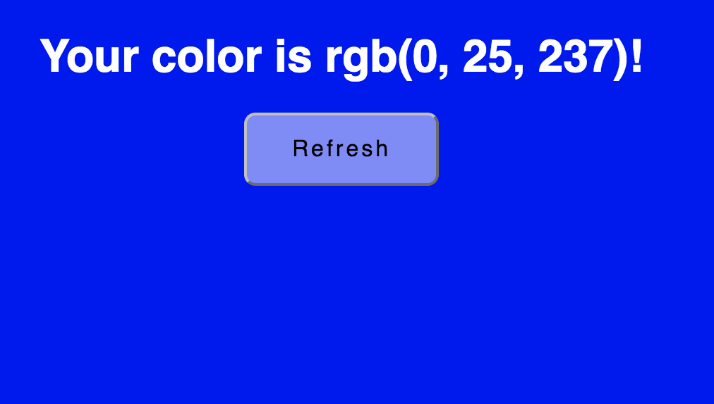
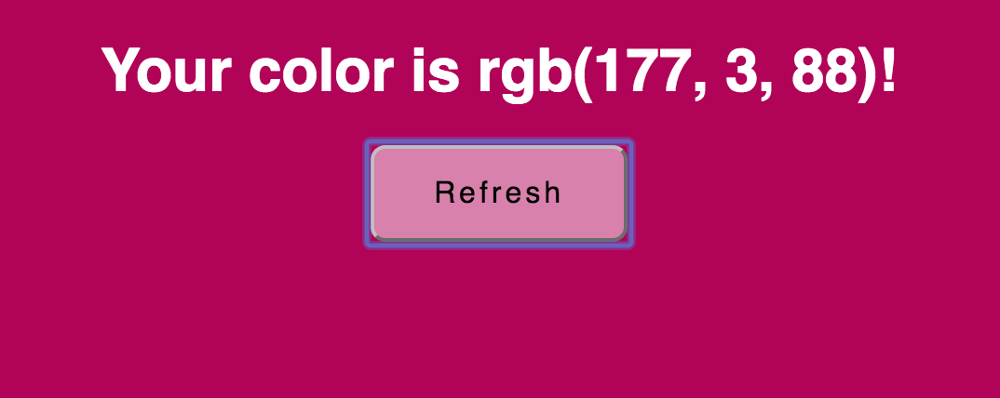
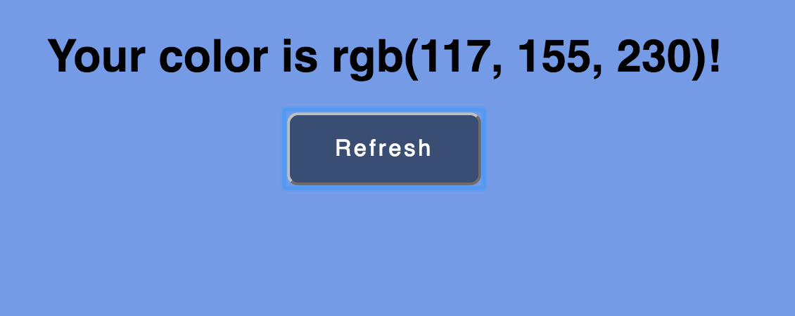

<h1>Color Picker</h1>

<h2>Overall</h2>
<p>React exercise with functions, components, and passing in props</p>
<p>When button is clicked, chooseColor function is called to randomly choose 3 numbers between 1 and 256. This creates a RGB color which changes the state of className (associated with the background and button color).</p>


<h2>Code snippits</h2>
<h4>Code snippit goes through process of Random class, how RGB is randomized, formatted, and effects background and button color.</h4>

```javascript

class Random extends Component {
    constructor(props){
        super(props)
        this.state = { 
            color: [0, 25, 237]
        }
        this.handleClick = this.handleClick.bind(this);
    }
    componentDidMount() {
        this.applyColor();
    }
    componentDidUpdate(prevProps, prevState) {
        this.applyColor();
    }
    //formats 'rgb' for DOM
    formatColor(ary) {
        return 'rgb(' + ary.join(', ') + ')';
    }
    //adjusts button color based on this.state.color for background
    isLight() {
        const rgb = this.state.color;
        return rgb.reduce((a,b) => a+b) < 127 * 3;
    }
    // applies background color to body of document
    applyColor() {
        const color = this.formatColor(this.state.color);
        document.body.style.background = color;
    }
    //chooses random numbers for rgb rendering
    chooseColor() {
        const random = [];
        for (let i = 0; i < 3; i++) {
            random.push(Math.floor(Math.random()*256));
        }
        return random;
    }
    // click handler event to choose color when button is clicked
    handleClick(){
        this.setState({ 
          color: this.chooseColor()
        });
      }

    render(){
        return(
            <div>
                <h1 className={this.isLight() ? 'white' : 'black'}>
                    Your color is {this.formatColor(this.state.color)}!
                </h1>
                <Button onClick={this.handleClick} light={this.isLight()}/>
            </div>
        )
    }
}

```
#Snapshots

<h4>Initial state of RGB</h4>
<br />

<h4>Random state after button clicked</h4>
<br />

<h4>Showing button color change dependant on background color</h4>
